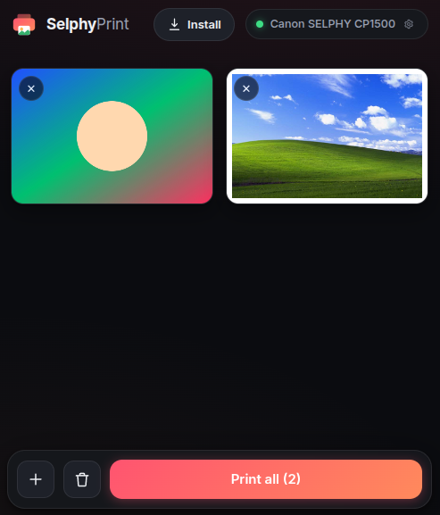
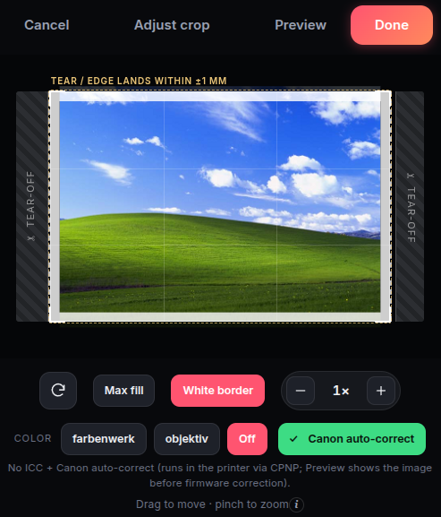

# Selphy Print

A self-hosted web-frontend and backend to do color-corrected prints from any device in your local wifi to a Canon CP1500. It can scale/rotate/add a border, and be a "share-to" target for any Android application.

<table>
  <tr>
    <td width="50%"></td>
    <td width="50%"></td>
  </tr>
</table>

A full AI-written readme can be found in README_AI.md, here are my human thoughts:

I got fed-up with the official app being slow, and *not being able to share a photo* to the app, always having to use the borderline unusable integrated photo-picker. This works fine for recent fotos, but was a terrible experience for older ones. Also, guests would always have to install and pair the app, which sucked.

This app is fully AI written by Opus+Fable. I have tested all features I am using, mostly on the nix build. Your mileage may vary. I don't recomment exposing this tool directly to the internet in any form!

You can install this website as an "App"/PWA. If you do that in *Chrome* on a "normal" Android, this will cause the Website to be wrapped into a real webAPK by google servers, and the app will be a valid "share target" in other apps.

That is, you can just go to your photo-library, select an image, hit "Share", "Selphy Print", and it shows up!

This does NOT work for degoogled Android/grapheneOS/non-chrome browsers. For those implementations we have a "helper APK" you can install and use as a share target. This APK is pre-built in this repo, but you can also built it yourself if you don't want to trust a random signing-cert.

## Usage

- Connect the printer to your local WiFi, take note of the IP.
- Install this app with either nix or docker (or ask AI how). I am using the nix setup myself. Set correct IP in the config. For the PWA to work correctly, you need a reverse-proxy with valid https certificate. Since I have one anyways for various services, it's not part of this repo.
- Print a calibration page, make note of the offsets, so the UI shows the correct boundaries. Note: this config is client-side only, defaults are always fetched from server config!
- *profit*.

You can easily switch the Printer between App mode and WiFi/website mode. The printer caches wifi creds, and just asks you "should i take the previous ones" on switching. BUT: whole flow takes like 30 seconds.

## Notes

- In theory this might work with other printers as well? Have not tested.
- There is working color correction, both via ICC profiles and the printer-built-in color-correction you can otherwise choose in the App. I have found that just relying on that and not using ICC profiles works best for my taste, but feel free to experiment. If you have a great setup, please open an issue/PR!